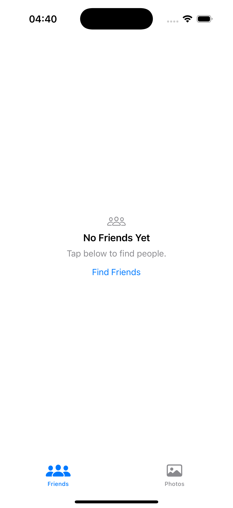
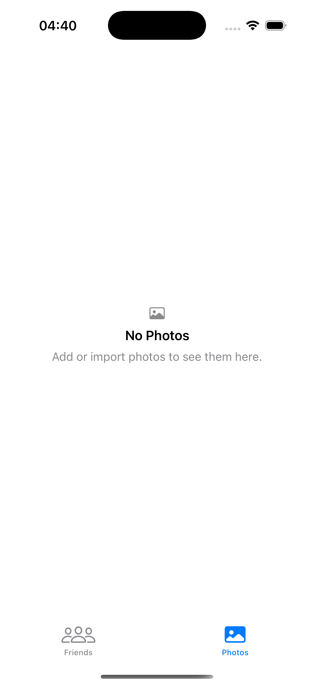

# EmptyStateKit

Tiny UIKit helpers for showing a friendly **empty state** in `UITableView` and `UICollectionView`.  
Zero dependencies. Straightforward API. Example app included.

<p align="center">
  
  &nbsp;&nbsp;&nbsp;
  
</p>

---

## What you get
- ✅ Simple, single-call API for tables & collections  
- ✅ Configurable: image, title, message, optional button + action  
- ✅ Swift Package Manager support (no extra deps)  
- ✅ Small, readable code that you can tweak if needed

---

## Install (Swift Package Manager)

**Xcode → File → Add Packages…**  
Paste this URL:  https://github.com/RajaHaseeb269/EmptyStateKit

---

## Quick Start

```swift
import EmptyStateKit

// Show or hide an empty state based on your data:
//For TableView :
tableView.updateEmptyStateIfNeeded(
    isEmpty: items.isEmpty,
    state: EmptyState(
        image: UIImage(systemName: "tray"),
        title: "No Items",
        message: "Add something to get started.",
        buttonTitle: "Add Item",
        buttonAction: { /* your action */ }
    )
)
```
```swift
import EmptyStateKit
//For CollectionView :
collectionView.updateEmptyStateIfNeeded(
    isEmpty: photos.isEmpty,
    state: EmptyState(
        image: UIImage(systemName: "photo"),
        title: "No Photos",
        message: "Import or add a photo."
    )
)
```
---

Tip: If your screen uses a tab bar, you may prefer to set
tableView.contentInsetAdjustmentBehavior = .never (or the same for collectionView) to keep layout consistent on first display.

---

**Example App**

Open Examples/EmptyStateDemo and run.
It shows:

Friends (UITableView) — empty state with a button

Photos (UICollectionView) — text-only empty state

---

Requirements

iOS 14+

Xcode 15+ / Swift 5.x

---

## License

This project is released under the MIT License. See the [LICENSE](LICENSE) file for details.

---

About

This is a small, focused utility built to keep empty-state code out of your view controllers and make behavior consistent across screens. PRs and suggestions are welcome.

If you paste this as-is, alignment and formatting will look great on GitHub.
